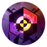
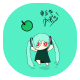
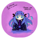

Show Banner
  

### Short Introduction

Hi there, you can call me Suara. I'm a college student, currently majoring in Informatics Engineering. Unlike most students, I haven't studied ML and AI related stuffs, instead trying to focus on webapps and design stuff only for a moment. My current focus language is python and typescript. I don't have much friends since I quite spent my time to studying for my future (I have big dream really and everyone also do), but feel free to get in touch with me anytime, I'm happy if someone teach me anything necessary to get a job, or even only chit chat also totally fine.

### Short Story

From time to time, I was trying to experiencing in web frameworks. Here's my quite story:

- I was used to learning VB.Net for 3-years back then when I high schools for building desktop apps (I was studied WPF too at that time for a bit). I got mentored only around 10 days, so my code was really cumbersome.
- HTML, CSS3 / Inline-styles, and JavaScript (even the basic only).
- Laravel as a fullstack ssr with my accompany from high schools for one project only (around 2020).
- Studying ReactJS but I found that Next.Js is quite fit for me. And for the styling, I'm using tailwindcss.
- And at the present... I'm learning [django](https://docs.djangoproject.com/en/4.2/releases/4.2.4/ 'Django 4.2.4') and currently focusing on [django rest framework](https://www.django-rest-framework.org/ 'Django Rest Framework') until now.
- Occasionally I'm going to learn Next.Js too to consume my APIs after I completed anything that need to be done from backend.

### Hobbies

I hope you got the idea what my hobby is... yes, Anime! ^^ (and especially it's quite old one and mostly all genre). I also a lot listening Japanese music, cover music, and vocaloid. Then I also love do random design on figma. It's not necessarily always UI/UX (since I'm not good at it too), but any design that can satisfy my boredom. Like the banner I made above, it's made from Figma. Third, when I don't know what to do, maybe playing some games on my phone. I'm playing kinda matching colors game, [Blue Archive](https://bluearchive.nexon.com/home 'Blue Archive ENG'), and Egg Party. On pc I usually play touhou and visual novels (but it's rare case I'm playing on pc). Other than that, I'm studying or taking a break.

### Current activity

I'm currently learning DRF by building project on **siythings-api** repos. There's still lot of things that I haven't studied yet when I studied Django as fullstack ssr (such as aws to store media images and others since I don't have cards that required international payment). So on this project I unfortunately restrict some of features when it's successfully deployed to the internet (hopefully).

Here's the total time I spent on my rest framework **siythings-api** project:

| no  | name                     | waka-stats                                                                                                                                                                                                                                              |
| :-: | ------------------------ | ------------------------------------------------------------------------------------------------------------------------------------------------------------------------------------------------------------------------------------------------------- |
|  1  | **repo: siythings-api**  |  |
|  2  | **repo: siythings-fe**   |  |
|  3  | **figma: siythings-fig** |  |

Although there's still lot of components and code that I need to improve such as nasty structure, bad codes everywhere, and many stuffs that require refactor. I hope my study could get paid off in the future.

### Last thing...

If you have any questions regarding myself, programming, anime songs or vocaloid, or other feel free to contact me through discord id (**Suara**). Thanks for visiting my profile and have a good day.

_P.S. I'm sorry if I made too much mistakes on English since I also currently studying it._

---

### Avicon varieties that I made

I love to make design variety on my icon, here is some of sample:

Show Icons
  

      

     

   

---

> [!IMPORTANT]

> - **💬 discord id:** **_Suara_** (_P.S._ Please let me know if you add me through github)
> - **📰 (pdf) portfolio:** [Portfolio - Google Drive](https://drive.google.com/file/d/1Q7E6uLaexgGlX3U648aGn3nolyh9Dgtl/view?usp=sharing 'last update on December 11, 2023') (_last update on December 11, 2023_)
> - **🔜 (pdf) resume:** coming soon...
> - **📊 wakatime:** [wakatime/@suarasiy](https://wakatime.com/@suarasiy)
> - **🌐 sns page:** [github/@sns](http://suarasiy.github.io/sns/)
