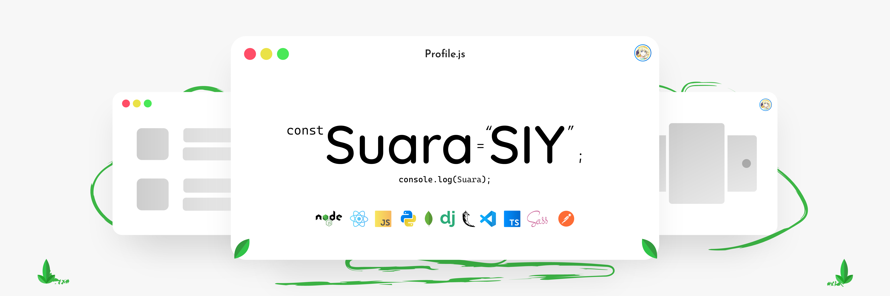
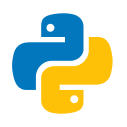
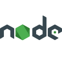
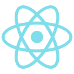
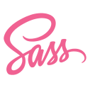
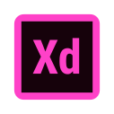

## Hi there 👋

I am Suara (20), from Indonesia. College (4th). Beginner in programming and GitHub.

## 🌱 Programming Passion

I'm currently learning / have interested in:

       

Currently my programming languages:

## 🌱 Design Passion Tools

I make design in:

## 📫 Get in touch with me

I want to connect with peoples and sharing the experiences about programming and many more, so I leave my SNS below. Please, feel free to send a message if you want:

| account   | id |
| :-------: | ---- |
|  | Suara#6359 |

## 📊 My GitHub stats

<!-- ## Time -->
<!--  -->

<!--
**suarasiy/suarasiy** is a ✨ _special_ ✨ repository because its `README.md` (this file) appears on your GitHub profile.

Here are some ideas to get you started:

- 🔭 I’m currently working on ...
- 🌱 I’m currently learning ...
- 👯 I’m looking to collaborate on ...
- 🤔 I’m looking for help with ...
- 💬 Ask me about ...
- 📫 How to reach me: ...
- 😄 Pronouns: ...
- ⚡ Fun fact: ...
-->
