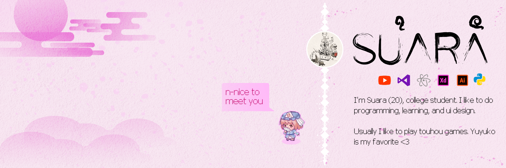

## Hi there 👋

I am Suara (20), from Indonesia. Currently 3rd semester in college. Beginner in programming and GitHub. Please be kind to me.

## 🌱 Programming Passion

I'm currently learning / have interested in:

| python        | status   |
| ------------- | :------: |
| Flask         |✅       |
| Flask-RESTful |✅       |
| django        |🔄       |

| other         | status   |
| ------------- | :------: |
| ReactJS       |🔄       |
| TypeScript    |🔄       |
| JavaScript    |🔄       |
| NodeJS        |🔄       |

## 🌱 Design Passion Tools

I make design in:

| software          | status   |
| ----------------- | :------: |
| Adobe Xd          | ✅      |
| Adobe Illustrator | ✅      |

## 📫 Get in touch with me

I want to connect with peoples and sharing the experiences about programming and many more, so I leave my SNS below. Please, feel free to send a message if you want:

- discord : Suara#6359

## ⚡ Hobbies

- Learning to write clean code
- Watching anime
- Listening music
- Playing card games / turn based

## 📊 My GitHub stats

  

<!--
**suarasiy/suarasiy** is a ✨ _special_ ✨ repository because its `README.md` (this file) appears on your GitHub profile.

Here are some ideas to get you started:

- 🔭 I’m currently working on ...
- 🌱 I’m currently learning ...
- 👯 I’m looking to collaborate on ...
- 🤔 I’m looking for help with ...
- 💬 Ask me about ...
- 📫 How to reach me: ...
- 😄 Pronouns: ...
- ⚡ Fun fact: ...
-->
